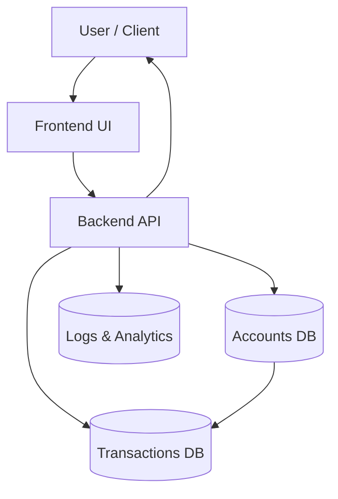

# 🏦 Banking-App

[](#license)  
[]()  
[]()  
[]()  
[]()

> A secure and modern banking application enabling account management, transactions, and analytics — built for reliability and performance.

---

## 🖥️ Overview

The Banking-App is a full-featured financial platform where users can securely register accounts, deposit and withdraw funds, view transaction history, and monitor analytics.  
It focuses on reliability, clean architecture, and modular design so it can scale and adapt across systems.

---

## 🧱 Tech Stack

| Layer             | Technology                         |
|-------------------|------------------------------------|
| Frontend / UI      | (React,Next.js)       |
| Backend            | (Next.js Server Actions)    |
| Database           | (PostgreSQL)         |
| Authentication     | JWT, Role-based Access             |
| Infrastructure     | Docker, CI/CD pipelines            |
| Security           | Encryption at rest, secure APIs   |


---

## ✨ Features

- ✅ Secure user account registration and login  
- 📥 Fund deposits and withdrawals  
- 📄 Transaction history and reporting  
- 📊 Dashboard analytics for users and admins  
- 🔐 Role-based access (user / admin)  
- 📦 Scalable and modular architecture  

---

## 🗺️ Architecture Diagram


# ⚙️ Installation
1️⃣ Clone the repository
```bash
git clone https://github.com/AbdullahBakouni/Banking-App.git
cd Banking-App
```
2️⃣ Install dependencies
```bash
npm install
# or
yarn install
```
3️⃣ Configure environment variables

Create a .env file:
```env
#POSTGRES DB CREDITIONALS
POSTGRES_USER=your Name
POSTGRES_PASSWORD=your Password
POSTGRES_DB=bank-app
POSTGRES_PORT=5432
POSTGRES_HOST=localhost
DATABASE_URL=postgres://Your Name:Your Password@localhost:5432/bank-app

#JWT
JWT_SECRET=your Secret


#PLAID
PLAID_CLIENT_ID=your Client Id
PLAID_SECRET=your Secret
PLAID_ENV=sandbox
PLAID_PRODUCTS=auth,transactions,identity
PLAID_COUNTRY=US,CA

#DWOLLA FOR TRANSACTIONS
DWOLLA_KEY=your Key
DWOLLA_SECRET=your Secret
DWOLLA_BASE_URL=https://api.sandbox.dwolla.com
DWOLLA_ENV=sandbox

```
4️⃣ Run locally
```bash
npm run dev
# or
yarn dev
```
# 🐳 Docker Setup
Build and run locally
```bash
docker build -t banking-app .
docker run -p 3000:3000 --env-file .env banking-app
```
Or use Docker compose
```bash
docker-compose up -d
```
# ☁️ Deployment (Optional)

You can deploy the Banking-App on Kubernetes, AWS, Azure, or any cloud platform:
```bash
docker build -t your-repo/banking-app:latest .
docker push your-repo/banking-app:latest

kubectl apply -f k8s/deployment.yaml
kubectl apply -f k8s/service.yaml
```
# 🛣️ Roadmap

 Add multi-currency support

 Add integration with payment gateways

 Add detailed analytics dashboard

 Add mobile app front-end

# 🤝 Contributing

Contributions are welcome!

Fork the repository

Create a branch (git checkout -b feature/your-feature)

Commit your changes (git commit -m "Add feature X")

Push to your branch (git push origin feature/your-feature)

Create a Pull Request 🎉

# 📜 License

Licensed under the MIT License © 2025 [Abdullah Bakouni](https://github.com/AbdullahBakouni)

# 🌍 Visit My Website

Check out My Project
👉 https://horizon-banka-pp.vercel.app
